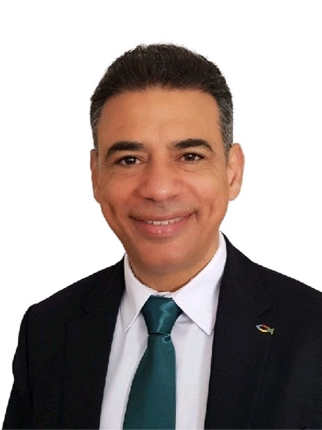

| Igreja Display | Call Phone | Send SMS | Compose Email | Superintendente | Tesoureiro | Secretário | LiderJovens | Pastor Assistente | Pastor Super Assistente | Pastor Regional | Pastor Nacional | Endereço | View Map | Aniversários_Igrejas | Banco |
| --- | --- | --- | --- | --- | --- | --- | --- | --- | --- | --- | --- | --- | --- | --- | --- |
| **Grupo: África** | | | | | | | | | | | | | | | |
| AD GUINEA-BISSAU |  |  |  |  Robson Ferreira Santos | .jpg) Vilmar Garcia Couto | EB4888BA-D041-4A9E-B1CA-72544139197A |  |  |  |  Robson Ferreira Santos |  |  |  |  |  |
| **Grupo: DURANGUESADO** | | | | | | | | | | | | | | | |
| AD DURANGO |  |  |  | .jpg) Vilmar Garcia Couto | .jpg) Malena Villarreal | .jpg) David Rocha Borges Couto | .jpg) Fernando Bonifacio |  |  | .jpg) Vilmar Garcia Couto | .jpg) Efferson Santos | Polígono Industrial de Industrial de Mallabiena, 13, 48215 Iurreta, Biscay, Espanha | [Mapa](https://maps.app.goo.gl/25L48QVzuTMpugmR7) |  |  |
| AD ELORRIO |  |  |  |  Robson Ferreira Santos | .jpg) Anai Marian Otalora Acha | .jpg) Anai Marian Otalora Acha |  |  |  | .jpg) Vilmar Garcia Couto | .jpg) Efferson Santos | Urkizuaran Kalea, 5, 48230 Elorrio, Bizkaia, Espanha | [Mapa](https://maps.app.goo.gl/C8xCptgmHqcTwshV9) |  |  |
| **Grupo: GRAN BILBAO** | | | | | | | | | | | | | | | |
| AD BARAKALDO |  |  |  | .jpg) Efferson Santos | .jpg) Samara Oliveira Neri De Paula | .jpg) Fabiula Nogueira Costa |  |  |  | .jpg) Efferson Santos | .jpg) Efferson Santos | Retuerto Kalea, 58, 1 planta, 48903 San Vicente de Barakaldo, Biscay, Espanha | [Mapa](https://maps.app.goo.gl/VfjGXPAjaPWmgd3NA) |  |  |
| AD BILBAO |  |  |  | .jpg) Edinso Yanez | .jpg) Genesis Zeledón Peralta | .jpg) Margarita Peralta |  |  |  | .jpg) Efferson Santos | .jpg) Efferson Santos |  |  |  |  |
| AD BOLUETA |  |  |  | .jpg) Illisnois Pérez Tamé | .jpg) Marcia De Melo Oliveira Silva | .jpg) Yulianny Molero |  |  |  | .jpg) Efferson Santos | .jpg) Efferson Santos | Crt. Bilbao Galdakao, n2, 3 izq , edificio Bolueta, 48004, bilbao |  |  |  |
| **Grupo: GUIPÚZCOA** | | | | | | | | | | | | | | | |
| AD IRÚN |  |  |  | .jpg) Josenildo Souza De Jesus | .jpg) Maria Lourdes Osório Ferrufino | .jpg) Adelina Neta Dos Santos De Jesus |  |  |  | .jpg) Onias Ferreira Da Silva | .jpg) Efferson Santos | Aduana Kalea, 27, 20302 Irun, Gipuzkoa, Espanha | [Mapa](https://maps.app.goo.gl/VwpA4s3B1PVRkBDj6) |  |  |
| **Grupo: REGIONAL 01** | | | | | | | | | | | | | | | |
| COMADEFE |  |  |  |  Robson Ferreira Santos | .jpg) Vilmar Garcia Couto | EB4888BA-D041-4A9E-B1CA-72544139197A |  |  |  |  |  |  |  |  |  |
| AD ALHANDRA |  |  |  | .jpg) Eliel Veras Oliveira | .jpg) Karen Waleska Silva Freitas | .jpg) Pablo Camargo Ferreira |  |  |  | .jpg) Sanzio Elmo Sousa Soares |  | R. Combatentes 06, 2600-427 Alhandra | [Mapa](https://maps.app.goo.gl/Pnvhb1SsWV2v1V4f7?g_st=ic) |  |  |
| AD ALVERCA |  |  |  | .jpg) Jackson Elias Pereira | .jpg) Alexandra Gonçalves | .jpg) Débora Santos Pereira |  |  |  | .jpg) Sanzio Elmo Sousa Soares |  | R. José António do Carmo 19, 2615-106 Alverca do Ribatejo | [Mapa](https://maps.app.goo.gl/PwNmbjorJx5yifDm8?g_st=ic) |  |  |
| AD PORTO ALTO |  |  |  | .jpg) David Rodrigues Vieira | .jpg) Guilherme De Oliveira Neves | .jpg) Vivian Florentino Arruda Rocha |  |  |  | .jpg) Sanzio Elmo Sousa Soares |  | Av. Nações Unidas, Porto Alto, 2135-197 Samora Correia | [Mapa](https://maps.app.goo.gl/W4qjSm68Lg9Pyv5d7?g_st=ic) |  |  |
| AD SEDE_CENTRAL |  |  |  | .jpg) Sanzio Elmo Sousa Soares | .jpg) José Silva | .jpg) Talia Almeida Neves |  |  | .jpg) Sanzio Elmo Sousa Soares | .jpg) Sanzio Elmo Sousa Soares |  | R. Alexandre Herculano 17, 2005-246 Santarém | [Mapa](https://maps.app.goo.gl/rhLToDPEvUGJohXaA) |  |  |
| REDE SEMEAR Outros Países ou Cidades |  |  |  |  Robson Ferreira Santos | .jpg) Vilmar Garcia Couto | .jpg) Hilmar Sathler Cesar |  |  |  |  |  |  |  |  |  |
| **Grupo: REGIONAL 02** | | | | | | | | | | | | | | | |
| AD CATUJAL |  |  |  | .jpg) Tiago Pereira Da Silva | .jpg) Laiane Jussara Morais Da Costa Silva | .jpg) Sara Teixeira |  |  |  | .jpg) João Paulo Santos Moreira |  | R. José Gomes Ferreira 72, 2680-352 Unhos | [Mapa](https://maps.app.goo.gl/DxXPhiQU3M8yCxtHA?g_st=ic) |  |  |
| AD MONTIJO |  |  |  | .jpg) Thiago Portela Medeiros | .jpg) Guilherme Antonio Ferreira |  Rones Pinto Dos Santos |  |  |  | .jpg) João Paulo Santos Moreira |  | R. José Joaquim Marques 40 A, 2870-362 Montijo | [Mapa](https://maps.app.goo.gl/QS3EYryRUkM1gT269?g_st=ic) |  |  |
| AD ODIVELAS |  |  |  | .jpg) Apolo Antoni Almeida | .jpg) Allan Conrado Reinaldo | .jpg) Natália Cristina Rocha Da Paz |  |  |  | .jpg) João Paulo Santos Moreira |  | Rua Major João Luís de Moura, Armazéns B, 1685-253 Famões | [Mapa](https://maps.app.goo.gl/2eFgu7vtUGNwBhvj8?g_st=ic) |  |  |